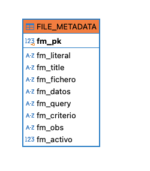

<!-- TOC --><a name="generador-de-datos-de-prueba"></a>
# GENERADOR DE DATOS DE PRUEBA  
[](https://www.python.org/)


## INDICE 
<!-- TOC start (generated with https://github.com/derlin/bitdowntoc) -->

- [GENERADOR DE DATOS DE PRUEBA  ](#generador-de-datos-de-prueba)
   * [Abstract](#abstract)
   * [Authors (QA Team)](#authors-qa-team)
   * [Instalación](#instalación)
      + [Obtención del código a ejecutar](#obtención-del-código-a-ejecutar)
      + [Versión de Python  ](#versión-de-python)
      + [Librerías  ](#librerías)
   * [Ejecución](#ejecución)
   * [Descripción del proceso completo (las tres fases del pipeline)](#descripción-del-proceso-completo-las-tres-fases-del-pipeline)
      + [FASE 1 - Preprocesado de los datos origen](#fase-1---preprocesado-de-los-datos-origen)
      + [FASE 2 - Carga de datos en la Base de Datos](#fase-2---carga-de-datos-en-la-base-de-datos)
      + [FASE 3 - Generación de los ficheros](#fase-3---generación-de-los-ficheros)
   * [Lista completa de scripts y su función](#lista-completa-de-scripts-y-su-función)
   * [Lista negra de empleados](#lista-negra-de-empleados)
   * [Usuarios sin acceso](#usuarios-sin-acceso)
   * [Tipología de usuarios según disponibilidad](#tipología-de-usuarios-según-disponibilidad)
- [ANEXOS](#anexos)
   * [ANEXO I - Detalle del código](#anexo-i---detalle-del-código)
      + [El orquestador](#el-orquestador)
      + [Las trazas del proceso](#las-trazas-del-proceso)
      + [Los scripts de preprocesado](#los-scripts-de-preprocesado)
      + [Creación de la base de datos](#creación-de-la-base-de-datos)
      + [Los scripts de carga](#los-scripts-de-carga)
      + [Cargar los metadatos y queries](#cargar-los-metadatos-y-queries)
      + [Generar los ficheros de datos](#generar-los-ficheros-de-datos)
   * [ANEXO II - Lógica para solicitud de variación del IRPF](#anexo-ii---lógica-para-solicitud-de-variación-del-irpf)
   * [ANEXO III - Esquema de la Base de Datos](#anexo-iii---esquema-de-la-base-de-datos)


<!-- TOC --><a name="abstract"></a>
## Abstract

**Proceso de generar ficheros de datos para alimentar tests automáticos.**  
Los datos se encuentran en el sistema corporativo SAP y son extraídos mediante un export. Dicho export de SAP requiere de un tratamiento para poder ser integrados en una base de datos relacional que permitirá su óptima explotación como información.
Finalmente dicha información se vuelca en unos ficheros que son los que alimentan de datos a los tests automáticos.  

El esquema general se muestra en la siguiente figura:


<!-- TOC --><a name="authors-qa-team"></a>
## Authors (QA Team)

- [Antonio Marín](mailto:4ht0h10@gmail.com)

*******************************************************  
<!-- TOC --><a name="instalación"></a>
## Instalación

Realmente no se trata de una instalación como tal, simplemente hay que asegurarse de disponer de las librerías de _Python_ requeridas, y lógicamente de los scripts que realizan la tarea. Teniendo eso ya podremos lanzar la ejecución, aunque habiendo antes configurado algunos datos de autenticación que no se guardan en el repositorio por motivos de seguridad. 

Esto se hace en el fichero ```config.yaml```.  
Aparte de algún _password_ también habría que cambiar el nombre de los ficheros si variasen respecto a los actuales.
Las instrucciones para todos estos temas de configuración se pueden encontrar en un fichero llamado ```config_template.yaml```.  

<!-- TOC --><a name="obtención-del-código-a-ejecutar"></a>
### Obtención del código a ejecutar
Los scripts están actualmente disponibles para su descarga en el siguiente [repositorio corporativo de Bitbucket][UST_REPO].  

<!-- TOC --><a name="versión-de-python"></a>
### Versión de Python  
Aunque muy probablemente funcione con versiones de 3.6 y superiores (no lo hemos probado) lo establecido es disponer de al menos la versión **Python 3.8.19**.

<!-- TOC --><a name="librerías"></a>
### Librerías  

Todas las librerías usadas adicionalmente al código se encuentran listadas en el fichero ```requirements.txt```  
Para instalarlas en el caso de no disponer de ellas simplemente se puede ejecutar este comando y se instalarán todas y con la versión adecuada:

```python
pip install -r requirements.txt
```  
Si se desea más detalle sobre el manejo de entornos en _Python_ puede echarse un vistazo a [esta breve guía][GUIA_PIP], donde además se explica el uso del fichero mencionado.
</br>
</br>


*******************************************************

<!-- TOC --><a name="ejecución"></a>
## Ejecución

Para ejecutar el proceso tenemos todo recogido en un único script de __Python__ que lo desencadena completo, desde la creación de la base de datos a la obtención de los ficheros finales.  
Simplemente se trata de ejecutar el siguiente comando:
```python
  python fertanilo_loader.py
```  
El detalle del funcionamiento de los distintos módulos que componen el proceso se trata en el [ANEXO I](#anexo-i---detalle-del-código)  

*******************************************************  
<!-- TOC --><a name="descripción-del-proceso-completo-las-tres-fases-del-pipeline"></a>
## Descripción del proceso completo (las tres fases del pipeline)

Lo primero es señalar que todo el proceso de generación de los ficheros de datos puede descomponerse en tres operaciones o fases que se llevan a cabo de forma consecutiva a modo de secuencia o _pipeline_. Estos son: el preprocesado de los datos de entrada, su inclusión en una base de datos relacional, y finalmente la generación de los ficheros con datos sacados de dicha base de datos.  

A continuación detallamos dichas etapas o fases.  

<!-- TOC --><a name="#fase-1---preprocesado-de-los-datos-origen"></a>
### FASE 1 - Preprocesado de los datos origen

Los datos -que provienen originalmente del sistema SAP usado en el depto. de _RR.HH_- requieren de unos ajustes antes de poder ser explotados. Dichos ajustes consiste en normalizar registros, correcciones de formatos, eliminar duplicidades y redundancia, así como añadir algunos datos adicionales producto de cálculos. Esto es lo que llamamos **preprocesado**, y se traduce en crear unos archivos nuevos en los que la información esté recogida de forma cabal, sin duplicidades ni datos redundantes o erróneos.  

El punto de partida son dos archivos _Excel_ en los que se agrupan datos de distinta naturaleza con el empleado de la organización como referencia. Básicamente se trata de dos ficheros, uno de los cuales lleva información del empleado y también una relación de sus anticipos de nómina. El otro fichero aglutina datos de ausencias del empleado, que en RR.HH dividen entre _absentismos_ y _suplencias_. Ambos ficheros pueden verse en color azul en la imagen.

  

- **Empleados y Anticipos**

El preprocesado del primer fichero Excel hará que sea descompuesto en otros dos ficheros que discriminan entre lo que son datos del propio empleado, como su nombre, fecha de alta, horario, cuenta bancaria, etc. y por otro lado los datos relativos a los anticipos que ha solicitado. Los dos ficheros Excel generados son **EMPLEADOS.xlsx** y **ANTICIPOS.xlsx** como se muestra en la imagen anterior.  

En el caso de los datos de _empleado_ hay que corregir algún detalle en el formato del NIF, homogenizar el formato de fechas, y también se aprovecha para añadir una columna extra en la que se indica si ese empleado puede pedir un cambio en la retención del IRPF, y en su caso la cantidad mínima de incremento que puede pedir. La lógica seguida para esto se detalla en el correspondiente [ANEXO II](#anexo-ii---lógica-para-solicitud-de-variación-del-irpf)  

Para los anticipos de nómina -información que también se encuentran en este mismo fichero- se trataba de extraer todos los datos que venían mezclados con los de empleados y poder así eliminar redundancias.  

- **Incidencias**

El otro preprocesado aplicado sobre el otro fichero Excel proporcionado desde _SAP_. En éste caso los datos de empleado vienen mezclados con los de las ausencias. Lo de las ausencias se refiere a la información de ausencias del empleado. En el depto. de _RR.HH_ trabajan clasificando las ausencias como _absentismos_ y _suplencias_, y así nos hacen llegar los datos. Pero en el preprocesado se acomodan al concepto _Incidencia_ establecido en todo lo relativo a la lógica de negocio empleada el el **área de juego** para la gestión de vendedores. El cocepto _Incidencia_ se refiere así a toda merma en el cómputo de horas laborales establecidas a priori para el empleado.  
El resultado de este segundo preprocesado es un fichero Excel **INCIDENCIAS.xlsx** con todos los datos y tipologías de las ausencias de los empleados. Actualmente tenemos inventariadas 139 tipos de _incidencia_.

Todo lo dicho para esta primera fase se lleva a cabo mediante tres _scripts_ cada uno de los cuales crea uno de los ficheros Excel. Un fichero para datos de empleado, otro con solicitudes de anticipo, y un tercero de incidencias. Son estos los ficheros sobre los que se trabajará como entrada de la siguiente fase del _pipeline_  que lleva hasta la obtención del producto final: los ficheros de texto con los datos de prueba para los tests.

<!-- TOC --><a name="fase-2--carga-de-datos-en-la-base-de-datos"></a>
### FASE 2 - Carga de datos en la Base de Datos

Partiendo de los ficheros Excel resultado del preprocesado anterior, ahora se trata de cargar los datos en una base de datos relacional.  

Las principal razón para elegir como base de datos relacional [SQLite][SQLiteWeb] es su ligereza. Y también por su independencia, pues se trata de una biblioteca de código sin ninguna otra dependencia. No hay que configurar nada.

✔️ No hay ningún servidor de base de datos. El cliente y el servidor se ejecutan en el mismo proceso.

✔️ SQLite es de dominio público, por lo que puede utilizarlo y distribuirlo libremente con la aplicación.

✔️ SQLite funciona en diversas plataformas y arquitecturas.


El detalle del **esquema de la base de datos** puede verse en el [ANEXO III](#anexo-iii---esquema-de-la-base-de-datos)  

La carga se lleva a cabo mediante unos scripts _Python_ encargados de poblar con los datos dicho esquema.  

Los scripts citados son:

```
carga_empleados.py
carga_anticipos.py
carga_incidencias.py
```

Y el esquema del proceso se muestra en la imagen siguiente:


<!-- TOC --><a name="fase-3---generación-de-los-ficheros"></a>
### FASE 3 - Generación de los ficheros

Ésta fase es la más importante en cuanto a que todo el proceso está orientado precisamente a la creación de los ficheros de datos que alimentarán los tests automáticos.  
El procedimiento es realmente sencillo: simplemente un _script_ Python que ejecuta las consultas a BBDD para obtener los datos correspondientes a cada test, y luego vuelca esos datos en el correspondiente fichero. Toda la complejidad de la lógica detrás de cada consulta se contiene en las _queries_ a la base de datos, por lo que el procedimiento de crear el fichero queda muy sencillo y basta un mismo _script_ para todos los ficheros.  

Un ejemplo de fichero resultante:  
>_CPA-WEB-TRAANTNOM-01-Gestiona-Tramites-Solicitud-Anticipo-Nomina.txt_

cuyo contenido es el siguiente:

```
73698036T|Once1234|ONCEONCE|6.89|

**** TRASOLVARIRPF-01: Solicitud de variación del porcentaje de retención de IRPF en nómina 

**** DATOS:
- NIF de un vendedor
- Clave Portal
- Clave Gestiona
- Porcentaje de referencia para el cambio (deberá de ser mayor)

**** CRITERIO DE BUSQUEDA DE USUARIO:
NIF de vendedor que pueda solicitar cambio de retención IRPF

**** QUERY:

SELECT e.NIF, CAST(e.solicitar_irpf AS TEXT) AS irpf 
FROM EMPLEADOS e
WHERE 
-- Porcentaje actual de referencia
e.solicitar_irpf <> 0
AND -- Vendedor
e.grupo = 1 
AND -- Usuario QA habilitado en el Portal
e.reservado = 0  
-- Elegimos uno al azar
ORDER BY RANDOM() LIMIT 1;

**** OBSERVACIONES:
Existe una lógica nada intuitiva con la que podemos saber si una solicitud es viable atendiendo a la restricción de que 'Sólo puede solicitar una modificación de %IRPF al año'.
Es decir, podemos saber si éste año ya se le ha implementado ese cambio hasta el mes en curso (si los datos están actualizados).
La mala suerte sería que justo en éste momento existiese esa petición en trámite en el Sistema para el usuario elegido. Eso haría fallar el test con un falso positivo.

¯\_(*̀ ﹏ ́*)_/¯
```
En realidad lo único realmente importante es la primera línea del fichero:
> 71698036T|Once1234|ONCEONCE|6.89|

Es lo único que va a leer el test durante su ejecución. Se trata de cada uno de los datos esperados separados por el símbolo '**|**' por convenio.  
El resto del contenido del fichero puede considerarse documentación, y su contenido se estructura actualmente de la siguiente forma:  

* El código identificativo del test con una breve mención a la casuística de la prueba,
* La relación de los datos necesarios para el test con su descripción
* El criterio usado para buscarlo en la BBDD
* La propia consulta SQL que se emplea y que muestra la lógica de la búsqueda
* Opcionalmente una serie de observaciones (si se considera relevante).

</br>
</br>

*******************************************************  

<!-- TOC --><a name="lista-completa-de-scripts-y-su-función"></a>
## Lista completa de scripts y su función


| Script         | Función         | Contexto                      |
| :----------- | :-------------- | :------------------------- |
| prepro_empleados.py |  Preprocesado del fichero de empleados | Preprocesado de ficheros de entrada |
| prepro_anticipos.py |  Preprocesado del fichero de anticipos de nómina | Preprocesado de ficheros de entrada |
| prepro_incidencias.py |  Preprocesado del fichero de incidencias | Preprocesado de ficheros de entrada |
| fertanilo_loader.py |  Centraliza todos los procesos, desde creación y carga de datos en la base de datos SQLite a la generación de ficheros | Orquestador |
| fertanilo_downloader.py | Genera los ficheros de datos a partir de la BD | Generación de ficheros de datos |
| file_generator.py |  Es una clase Python usada por _fertanilo_downloader.py_ con métodos para trabajar con ficheros | Generación de ficheros de datos |
| carga_empleados.py |  Carga los empleados en la BD | Carga de BD |
| carga_anticipos.py |  Carga los anticipos de nómina en la BD | Carga de BD |
| carga_incidencias.py |  Carga los datos de incidencias en la BD | Carga de BD |
| listanegra_carga.py |  Actualiza en la BD el estado de los Empleados que están reservados y no se deben usar | Carga de BD |
| load_queries.py |  Usa el script _queries.sql_ para cargar en BD los metadatos para los ficheros | Carga de BD |
| crea_basedatos.py | Crea la base de datos conteniendo únicamente los datos de las tablas maestras | Creación de BD  |
| crea_bd.sql |  Script SQL que crea la BD y puebla las tablas maestras | Script SQL |
| queries.sql |  Script SQL que carga de los datos que se usarán en la generación de los ficheros finales | Script SQL |

</br>
</br>

*******************************************************  
<!-- TOC --><a name="lista-negra-de-empleados"></a>
## Lista negra de empleados
Los tests automáticos se llevan a cabo en el entorno dedicado ACP/CAL con usuarios pertenecientes a la Delegación Territorial de Asturias, el 203. Pero los tests automáticos no son las únicas pruebas que se llevan a cabo en dicho entorno.


Con la finalidad de no interferir entre los distintos equipos que puedan trabajar en dicho entorno se ha establecido una reserva de usuarios que no serán nunca usados en los procesos automáticos. Esta elección se ha hecho teniendo en cuenta la complejidad y diversidad de casuísticas que se tratan en los tests, intentando dejar un conjunto suficiente para los mismos. Resumiendo, se ha implementado una especie de _lista negra_ de usuarios que quedan exentos de la posibilidad de ser elegidos en los tests automáticos.

La manera de recoger esta lista es sencilla, tomando como entrada una vez más un fichero Excel donde están dichos usuarios. Mediante el _script_ ```listanegra_carga.py``` se procede a actualizar los empleados disponibles en la Base de Datos _marcando_ a los que no deben de ser elegidos.


Después de este proceso, en el fichero ```lista_negra.log``` quedan registrados los usuarios que han sido marcados en la base de datos. Igualmente todos aquellos que por distintas causas no hubiesen sido añadidos aunque figurasen inicialmente en dicha relación.

<!-- TOC --><a name="usuarios-sin-acceso"></a>
## Usuarios sin acceso
Hay otra circunstancia de usuarios que nos hemos encontrado y que tenemos que tener en cuenta: aquellos empleados del 203 que no pueden acceder al Portal. El que exita ésta tipologia de empleados es debido a una serie de causas más o menos complejas pero que no tienen interés para lo que nos ocupa. **Lo que nos ocupa es que existe una serie de usuarios disponibles a priori pero que no consiguen entrar en la web**, y necesitamos saber cuales son para evitarlos.

Para averiguar qué usuarios son hacemos una batida sobre todos los actuales empleados registrads en nuestra tabla EMPLEADOS e identificamos los que no pueden acceder. Esta nueva tipología de usuarios constituída por empleados que no pueden acceder al Portal y las demás se detallan en el siguiente apartado.

<!-- TOC --><a name="tipología-de-usuarios-según-disponibilidad"></a>
## Tipología de usuarios según disponibilidad
Las distintas circunstancias que definen si un empleado registrado en el sistema se puede usar en los tests o no, se resume en el propio sistema de la siguiente manera:
En la tabla EMPLEADOS, y como un atributo más del empleado, se dispone de un valor _entero_ en el campo de nombre '*reservado*' con este significado:

```
  0 - El empleado se puede usar en los test por parte del equipo QA
  1 - Reservado en la lista negra, no se deben usar por parte del equipo QA
  2 - Se podría usar por QA pero no accede al portal con el password que se supone le corresponde
  3 - Estaba ya reservado en la lista negra, pero es que además no accede con el pass
  4 - Empleado teoricamente disponible pero no ha accedido nunca y le obliga a cambiar la clave
  5 - Empleado que no se puede usar y además no ha accedido nunca y le obliga a cambiar la clave
  6 - Empleado 'quemado'. Usado en algún test previo que ha cambiado su situación administrativa
```

El caso es que necesitamos averiguar cuales de nuestros empleados no pueden acceder al Portal y poder así prevenir la posibilidad de intentar usarlos en los tests automáticos. Este proceso lo llevamos a cabo en dos pasos. El primer paso usando la herramienta [Postman][Postman] consiste en hacer *requests* con las credenciales de cada usuario para determinar cuales de ellos tienen problemas de acceso. Una vez que disponemos de esa relación de usuarios *defectuosos* se trata de hacer las correspondientes actualizaciones en la base de datos indicando en el estado de esos usuarios que no se pueden usar tampoco, al igual que pasa con los reservados.

No detallamos este procedimiento por considerarlo de alguna manera un paso excepcional ajeno al ciclo de generación de ficheros que aquí nos ocupa.  
Simplemente mencionamos los *scripts* implicados puesto que se ha considerado disponerlos en el mismo repositorio con el resto del código. Concrétamente en el directorio ```/utils```  
Estos  *scripts* son:  
````
noaccessusers_list.py
noaccessusers_update.py
````
El primero de ellos vuelca la lista de usuarios problemáticos a partir del *log* de [Postman][Postman], y el segundo es el encargado del *update* en la base de datos para cada usuario.
</br>
</br>


<!-- TOC --><a name="anexos"></a>
# ANEXOS
</br>
</br>


<!-- TOC --><a name="anexo-i---detalle-del-código"></a>
## ANEXO I - Detalle del código

<!-- TOC --><a name="el-orquestador"></a>
### El orquestador  

Llamamos _orquestador_ al script que aúna dentro toda la secuencia de ejecuciones del proceso: ```fertanilo_loader.py```  
Desde la creación del esquema de datos hasta la generación final de los ficheros. Igualmente va recopilando información de como se desarrolla todo el proceso, como se describe en le punto siguiente.


<!-- TOC --><a name="las-trazas-del-proceso"></a>
### Las trazas del proceso

Se dispone de un completo sistema de _logs_ en los que queda registro de toda la actividad de los _scripts_. Cada proceso tiene su propio fichero de de log, y adicionalmente todo el proceso se detalla también el un _log_ centralizado en el fichero llamado ```orquestador.log```.  
Todos estos fichero se recogen en el directorio ```/log```, para sorpresa de nadie.


<!-- TOC --><a name="los-scripts-de-preprocesado"></a>
### Los scripts de preprocesado  
```
prepro_empleados.py  
prepro_anticipos.py  
prepro_incidencias.py  
```

Los tres scripts realizan un proceso parecido, consistente en leer el fichero Excel de entrada procedente del volcado SAP y crear otro fichero de salida pero con los datos ordenados y corregidos. Como el nombre apunta, el primero se ocupa de los datos relativos al empleado, el segundo de los anticipos solicitados, y finalmente el tercero extrae las incidencias.  
Los tres utilizan internamente la [librería Pandas][PANDAS] usadas en _Ciencia de Datos_ para el análisis y manejo de ficheros con grandes cantidades de información.  

<!-- TOC --><a name="creación-de-la-base-de-datos"></a>
### Creación de la base de datos  
La base de datos de tipo [SQLite][SQLiteWeb] se recrea desde cero cada vez. Para ello se tiene el script ```crea_basedatos.py``` que a su vez utiliza el script SQL de nombre ```crea_bd.sql``` (su nombre se define en *config.yaml*) que contiene las instrucciones propias de creación del esquema en SQL.

<!-- TOC --><a name="los-scripts-de-carga"></a>
### Los scripts de carga  

```
carga_empleadospy  
carga_anticipos.py  
carga_incidencias.py  
```

De nuevo los tres scripts tienen una estructura y funcionamiento similar que podría resumirse como "leer los datos del fichero preprocesado y proceder a insertarlos en la base de datos". Nuevamente se recurre a [Pandas][PANDAS] para interactuar con el fichero. Para la base de datos se usa la librería [sqlite3][sqlite3] que viene ya por defecto con cualquier distribución de _Python_.  
De nuevo como su nombre apunta, cada script se ocupa de su propia tarea que será respectivamente cargar datos de empleado, o cargar anticipos, o cargar las incidencias.  

<!-- TOC --><a name="cargar-los-metadatos-y-queries"></a>
### Cargar los metadatos y queries

Tarea del script ```load_queries.py```  
Se trata de meter en la base de datos también todo lo relativo a los ficheros finales. Tanto nombres, contenido y literales (lo que llamamos _metadatos_ ) como también las consultas (_queries_). De esta forma tenemos centralizados todos los datos, tanto los propios datos de prueba como la lógica para obtenerlos. El fichero de SQL usado por debajo y que contiene las sentencias _DDL_ es ```queries.sql```.

<!-- TOC --><a name="generar-los-ficheros-de-datos"></a>
### Generar los ficheros de datos

Este es el último de los procesos, el último paso.  
Y el más trascendente porque todo lo demás que hemos visto se encamina a obtener estos ficheros.  
De ello se ocupan dos programas python:
```fertanilo_downloader.py``` que es el que obtiene los datos de la base de datos, y la _clase_ ```file_generatos.py``` usada por el anterior para materializar el fichero a partir de esos datos.  
Como ya hemos apuntado antes, toda la información necesaria está contenida en la base de datos, por lo que este programa se limita a consultarla y componer cada fichero con la información que le corresponda.  

*******************************************************  

<!-- TOC --><a name="anexo-ii---lógica-para-solicitud-de-variación-del-irpf"></a>
## ANEXO II - Lógica para solicitud de variación del IRPF


Para las gestiones de IRPF los test necesitan saber si el empleado ha solicitado ya su modificación, puesto que sólo puede hacerse una vez por año.
En la tabla de empleados viene una sucesión de valores que indican el IRPF aplicado asi como el calculado desglosado en una fecha determinada. Las columnas “Porcentaje aplicado” y “Porcentaje Nómina” aplican a la situación en el momento de realizar el export de SAP.

-**Porcentaje nómina**   = la calculado por el sistema</br>
-**Porcentaje aplicado** = el que ha pedido el empleado

**Restricciones:**  
✔️ Se puede solicitar una modificación de %IRPF al año, no más de eso.  
✔️ Sólo se puede pedir una aplicación de un tipo %IRPF superior a la calculada por el sistema (superior a “Porcentaje Nómina”). Es decir, puedes pedir que te retengan de más, pero no de menos.

**La lógica implementada según casuística esla siguiente:**

- “Porcentaje aplicado” y “Porcentaje Nómina” son iguales y distintos de cero: el empleado **SÍ** ha solicitado modificación de % de IRPF.
- “Porcentaje aplicado” = 0 y “Porcentaje Nómina” != 0, el empleado **NO** ha solicitado modificación de % de IRPF (se le aplica el % nomina, es decir, el calculado)
- Hay unos cuantos casos “Porcentaje aplicado”=0 y “Porcentaje Nómina”=0. Estos son casos en los que el empleado **NO** ha solicitado modificación %IRPF y tampoco se le está aplicando retención alguna (o bien cobran por debajo del mínimo en contratos que son indefinidos o superiores a un año, o bien tienen un grado de minusvalía superior al 65% y no le aplica retención).
- “Porcentaje aplicado” != 0 y “Porcentaje Nómina” != 0 y “Porcentaje aplicado” < “Porcentaje Nómina”, aplica el “Porcentaje Nómina” (calculado). Son empleados que sí han pedido modificación de %IRPF y que en algún momento se les aplicó el % de la primera columna, pero en este momento les aplica el calculado (el de nómina).
- “Porcentaje aplicado” != 0 y “Porcentaje Nómina” != 0 y “Porcentaje aplicado” > “Porcentaje Nómina”, aplica el “Porcentaje aplicado”. Son empleados que **SÍ** han pedido modificación de %IRPF.

En tabla queda así:

| % aplicado   | % calculado     | Relación   | ¿Puede solicitar modificación?         |
|:------------:|:---------------:|:----------:|:-------------------------------------- |
| X ≠ 0        | Y ≠ 0           |  X = Y     | NO                                     |
| 0            | Y ≠ 0           |            | SÍ (mayor que Y)                       |
| 0            |     0           |            | NO                                     |
| X ≠ 0        |     Y           |    X < Y   | NO (Lo pidió en el pasado)             |
| X ≠ 0        | Y ≠ 0           |  X > Y     | NO                                     |

Y en pseudocódigo sería:


```
Si (Aplicado = 0) AND (Nómina ≠ 0) THEN SÍ puede pedir % IRPF mayor que Nómina

ELSE NO puede pedir modificación IRPF
```
</br>
</br>

*******************************************************  
<!-- TOC --><a name="anexo-iii---esquema-de-la-base-de-datos"></a>
## ANEXO III - Esquema de la Base de Datos

La base de datos se estructura actualmente a partir de tres bloques principales:</br>
1. el empleado y sus datos con la tabla **EMPLEADOS** como núcleo,</br>
2. los anticipos de nómina solicitados por el empleado recogidos en la tabla **ANTICIPOS**, y</br>
3. las ausencias registradas del empleado en la tabla **INCIDENCIAS**.</br>

El esquema se completa con una serie de _tablas maestras_ ligadas mediante restricciones de tipo _foreing key_ y donde se recogen las distintas tipologías de las entidades del modelo.


Adicionalmente a lo relacionado con el modelo conceptual también se ha decidido incluir en la propia base de datos la lógica de la obtención de los datos. Así los datos de los que se componen los ficheros de salida tienen las consultas (_queries_) para cada uno en la propia base de datos. Esto supone un conjunto más completo y autocontenido, y también se pueden usar estas consultas y datos para otros futuros procesos de forma fácil.</br>
El detalle puede verse en la siguiente tabla:</br>



	  ✔️  fm_pk: la clave primaria
	  ✔️  fm_literal: Un acrónimo con el que se identifica el test automático
	  ✔️  fm_title: Descripción correspondiente a la prueba relacionada
	  ✔️  fm_fichero: Nombre del fichero físico con su correspondiente nomenclatura
	  ✔️  fm_datos: relación de datos que recoge el fichero y que se usarán en el test en el correspondiente test
	  ✔️  fm_query: la propia consulta SQL usada para obtener los datos y grabarlos en el fichero
	  ✔️  fm_criterio: una descripción somera de la consulta
	  ✔️  fm_obs: observaciones remarcables si es que las hay
	  ✔️  fm_activo: flag para indicar si el test está actualmente activo
</br>
</br>

<!-- TOC end -->

-----  
</br>

  
  
[](https://docs.python.org/3/library/sqlite3.html)  
[](https://pandas.pydata.org/)  
  
[](https://www.postman.com/)


[SQLiteWeb]: https://www.sqlite.org/
[UST_REPO]: https://bitbucket.org/ustglobal-spain/fertanilo-11-integration/src/main/
[GUIA_PIP]: https://www.freecodecamp.org/news/python-requirementstxt-explained/
[PANDAS]: https://pandas.pydata.org/
[sqlite3]: https://docs.python.org/3/library/sqlite3.html
[Postman]: https://www.postman.com/


